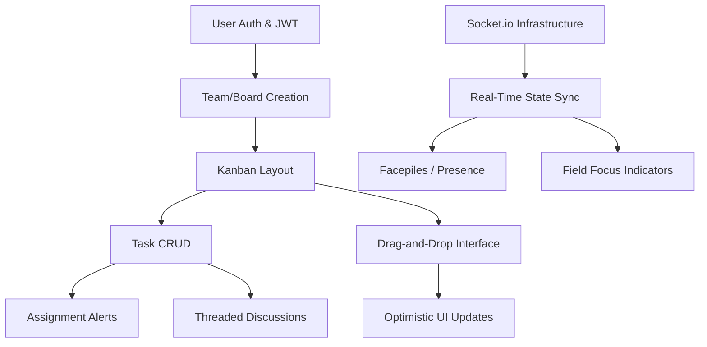

# Feature Landscape: Real-Time Collaborative Task Management

**Domain:** Real-Time Collaborative Task Management (Kanban)
**Researched:** 2024-03-31
**Confidence:** HIGH (Based on 2024/2025 industry standards for tools like Linear, Trello, and Raycast)

## Table Stakes

Features users expect in any modern collaborative tool. Missing these causes users to churn or perceive the app as "broken" or "legacy."

| Feature | Why Expected | Complexity | Notes |
|---------|--------------|------------|-------|
| **Instant Real-Time Sync** | Modern collaboration assumes no manual refreshes. Changes by others must appear in <100ms. | High | Requires robust Socket.io/WebSocket architecture and conflict handling. |
| **Kanban (Drag-and-Drop)** | The standard mental model for task management. Needs to feel tactile and fluid. | Medium | Use `dnd-kit` or `react-beautiful-dnd`. State must sync globally on drop. |
| **Presence Indicators** | "Facepiles" showing who is active on a board or card. Prevents "ghosting" feel. | Medium | Track user-room associations in backend/Redis. |
| **Optimistic UI** | Actions must feel instantaneous locally while syncing in the background. | Medium | Requires state management (Redux Toolkit) with rollback capabilities on error. |
| **Threaded Comments** | Essential for task-specific context. Needs @mentions for notification triggers. | Medium | Basic rich-text support (Markdown) is standard. |
| **Basic Metadata** | Assignments, due dates, priority levels, and labels/tags. | Low | Core relational data. |
| **Live Notifications** | Push/in-app alerts when assigned or mentioned. | Medium | Socket-based for in-app; push/email for external. |

## Differentiators

Features that move the product from "yet another Trello clone" to a high-performance productivity tool.

| Feature | Value Proposition | Complexity | Notes |
|---------|-------------------|------------|-------|
| **Live Focus Indicators** | See exactly which field (Title, Description) another user is editing in real-time. | High | High-frequency socket events; requires careful debouncing. |
| **Keyboard-First UX** | "Linear-style" command palette (Cmd+K) and single-key shortcuts (e.g., 'C' for create). | Medium | Dramatically increases perceived speed for power users. |
| **Semantic AI Triage** | AI that clusters tasks, identifies duplicates, or suggests assignees based on context. | High | Integration with LLMs (OpenAI/Anthropic) + Vector DB for embeddings. |
| **Automated Status Sync** | Task moves automatically when a GitHub PR is opened or a Figma comment is resolved. | Medium | Requires Webhook integrations with common dev tools. |
| **Local-First Performance** | Near-zero load times and full offline support with transparent background sync. | Very High | Usually requires CRDTs (Yjs/Automerge) or specific libs (Replicache). |
| **Activity Feed (Time Machine)** | A granular view of how a task evolved, allowing users to "scrub" through changes. | High | Requires event-sourcing or very detailed audit logging. |

## Anti-Features

Features to explicitly NOT build to maintain speed and focus.

| Anti-Feature | Why Avoid | What to Do Instead |
|--------------|-----------|-------------------|
| **Deep Hierarchy** | Nesting (Org > Space > Project > Folder > List > Task) causes navigation fatigue. | Keep a "flat" structure: Boards > Lists > Cards. Use powerful filtering instead. |
| **In-App Direct Chat** | Teams already use Slack/Discord. Proprietary chat becomes a "ghost town." | Keep communication strictly task-bound via comments. |
| **Complex Workflow Builders** | Rigid "If-Then" logic is hard to set up and maintain for agile teams. | Use simple "Status" transitions and lightweight automation. |
| **Granular Per-Field Permissions** | Over-engineering security for small/medium teams kills collaboration speed. | Use broad roles: Admin (manage board) vs. Member (manage tasks). |
| **Mandatory "Required" Fields** | Friction at the point of task creation prevents people from capturing ideas. | Allow fast creation; use AI to suggest missing metadata later. |

## Feature Dependencies

## MVP Recommendation

Prioritize a "High-Performance Core":
1.  **Instant Real-Time Sync**: The "Wow" factor when two people use it.
2.  **Optimistic UI + Kanban**: Making the app feel faster than it is.
3.  **Presence Indicators**: Validating the "Multiplayer" promise immediately.
4.  **Keyboard Shortcuts (Basics)**: Highlighting the focus on speed.

**Defer:**
-   **Local-First (CRDTs)**: High complexity ceiling; Socket-based sync is sufficient for MVP validation.
-   **AI Features**: Focus on core stability first.
-   **Integrations**: Build a solid internal experience before branching out.

## Sources

- [Linear.app - Product Philosophy](https://linear.app/method)
- [Trello - Power-Ups & Features](https://trello.com/features)
- [Industry Analysis: The State of PM Tools 2024](https://www.producthunt.com/stories/the-future-of-project-management)
- [Real-time Collaboration Patterns (Socket.io Blog)](https://socket.io/blog/real-time-collaboration/)
